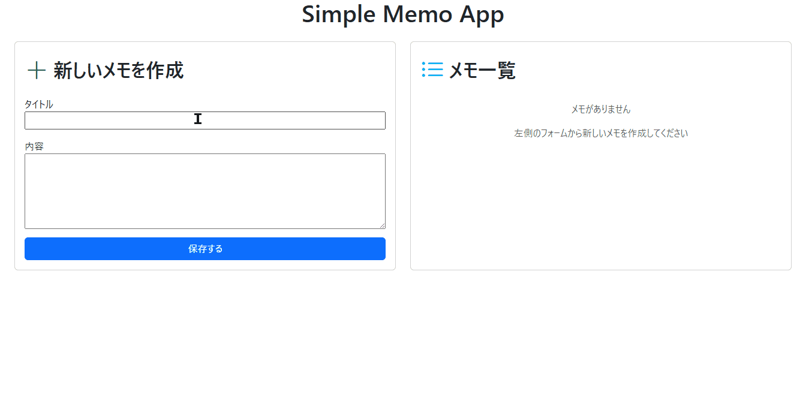

# simple-memo-api-practice

## 概要  
このプロジェクトは、Node.js と Express を使い API を構築し、HTML・CSS・JavaScript（axios利用）でページ遷移を行わずにメモの作成・表示・編集・削除を行えるシンプルなメモアプリです。  
REST API の設計や非同期通信、データベースとのやりとりの基本を学ぶことを目的として制作しました。

## デモ

## 主な機能  
- メモの作成（タイトルと本文）  
- メモの一覧表示  
- メモの編集  
- メモの削除  
- MongoDBによるデータの管理
- フロントエンドからの非同期通信（axios 使用）

## 使用技術  
- **フロントエンド**   
  - HTML / CSS（Bootstrap）  
  - JavaScript（axiosを使ったAPI通信）

- **バックエンド**  
  - Node.js  
  - Express  
  - MongoDB（Mongoose 使用）